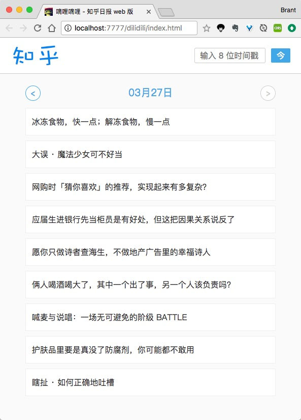

# dilidili
这是一个基本款的知乎日报 web 客户端，或许叫做 dailydaily 更合适 :)

## 效果

## 技术栈
- 前端框架：[Vue.js](https://github.com/vuejs/vue)
- 数据来源：[APIs](https://github.com/izzyleung/ZhihuDailyPurify/wiki/%E7%9F%A5%E4%B9%8E%E6%97%A5%E6%8A%A5-API-%E5%88%86%E6%9E%90)
- 数据请求：[axios](https://github.com/mzabriskie/axios)

## 其他问题
- 关于跨域：可以 nginx 搭建反向代理，或者直接用 [Allow-Control-Allow-Origin: *](https://chrome.google.com/webstore/detail/allow-control-allow-origi/nlfbmbojpeacfghkpbjhddihlkkiljbi) 这个 chrome 插件
- 关于图片：由于知乎防盗链，所以暂时懒得折腾了，以后有空再尝试